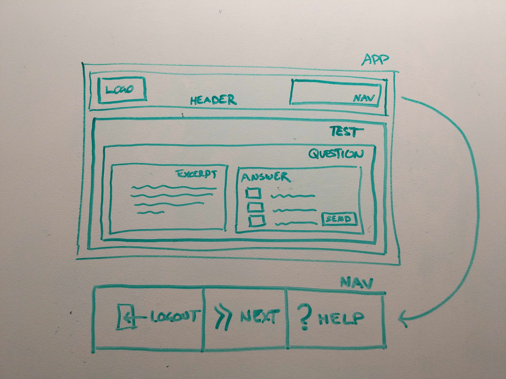

## Introduction

- Who am I?
- What team am I on?
- What is our team doing?
- What projects am I working on personally?
	+ RI/MI in React
	+ Advising teams on front-end tech
	+ Working Groups
	+ Engineering Workshops

## About The Workshops

### Why do these Workshops exist?

- HMH Share Engineering Knowledge
	+ An education company should always be learning
	+ To reach technical concensus quickly
	+ Have fun learning!

### Who can run a workshop?

- Anyone from HMH Engineering

### When will these workshops happen?

- Short Topic: (Mondays Weekly)
	Subject to how many people get involved.
- Deep Topic: (TBD - every 2 months)
	Usually an introduction course that.

### How do you get on the speaking list?

- Contact: 
	+ Alistair MacDonald (me)
	+ Mike Ryan
- Fill out [this Survey Monkey form](https://www.surveymonkey.com/r/Y2XNZ6Y)

# Workshop

## What is prop Drilling?

- Show of hands: how many use prop drilling?
- Can someone give an example of what prop drilling is and why it's used?
- When does prop drilling become cumbersome?
- What alternatives are there to prop-drilling?

Demo: [Prop Drilling](https://codesandbox.io/s/q87kpjzlyj)

Scenario: Reading Inventory

## The Context API - What is it?

> In a typical React application, data is passed top-down (parent to child) via props, but this can be cumbersome for certain types of props (e.g. locale preference, UI theme) that are required by many components within an application. Context provides a way to share values like these between components without having to explicitly pass a prop through every level of the tree.  
> [React Docs - Context API](https://reactjs.org/docs/context.html)

- Provider
- Consumer
- CreateContext (provider/comsumer pair)

Scenario:

- Your React app can switch between a two UI themes, eg: Night (Dark), Day (Light).
- Every UI component in your React app will have to change it's color.

Demo: [React Context API - Extended Theme Example](https://codesandbox.io/s/4jxm37239x)

- Talk through how the demo is working
- File order:
	+ theme-context.js
	+ theme-button.js
	+ index.js

This is all well and good, but how can the deep button change state?

## Don't use props for...

> **Note:** Don’t use context just to avoid passing props a few levels down. Stick to cases where the same data needs to be accessed in many components at multiple levels.  
> - The React docs: https://reactjs.org/docs/context.html#when-to-use-context

